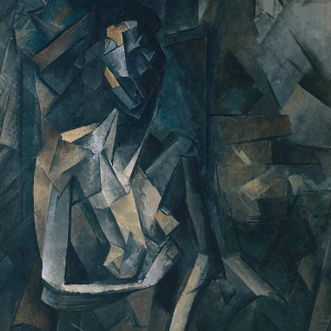

# Assignment #4 - Neural Style Transfer

In this assignment, I will implement neural style transfer which resembles specific content in a certain artistic style. For example, generate cat images in Ukiyo-e style. The algorithm takes in a content image, a style image, and another input image. The input image is optimized to match the previous two target images in content and style distance space.

## Part 1: Content Reconstruction 

#### Effect of optimizing content loss at different layers: 

|                        Original Image                        |                       layer: `conv_2`                        |                       layer: `conv_4`                        |
| :----------------------------------------------------------: | :----------------------------------------------------------: | :----------------------------------------------------------: |
|                               |  |  |
|                     **layer: `conv_6`**                      |                     **layer: `conv_7`**                      |                     **layer: `conv_8`**                      |
|  |  |  |
|                     **layer: `conv_10`**                     |                     **layer: `conv_12`**                     |                     **layer: `conv_14`**                     |
|  |  |  |

Here the conv naming convention is defined in a way that the smaller the number the closer it is to the end of the network. i.e, `conv_2` is last second conv layer of the VGG. 

```
------------------- Model Layers -------------------
Name: conv_1,  Layer: Conv2d(3, 64, kernel_size=(3, 3), stride=(1, 1), padding=(1, 1))
Name: relu_1,  Layer: ReLU()
Name: conv_2,  Layer: Conv2d(64, 64, kernel_size=(3, 3), stride=(1, 1), padding=(1, 1))
Name: relu_2,  Layer: ReLU()
Name: pool_2,  Layer: MaxPool2d(kernel_size=2, stride=2, padding=0, dilation=1, ceil_mode=False)
Name: conv_3,  Layer: Conv2d(64, 128, kernel_size=(3, 3), stride=(1, 1), padding=(1, 1))
Name: relu_3,  Layer: ReLU()
Name: conv_4,  Layer: Conv2d(128, 128, kernel_size=(3, 3), stride=(1, 1), padding=(1, 1))
Name: relu_4,  Layer: ReLU()
Name: pool_4,  Layer: MaxPool2d(kernel_size=2, stride=2, padding=0, dilation=1, ceil_mode=False)
Name: conv_5,  Layer: Conv2d(128, 256, kernel_size=(3, 3), stride=(1, 1), padding=(1, 1))
Name: relu_5,  Layer: ReLU()
Name: conv_6,  Layer: Conv2d(256, 256, kernel_size=(3, 3), stride=(1, 1), padding=(1, 1))
Name: relu_6,  Layer: ReLU()
Name: conv_7,  Layer: Conv2d(256, 256, kernel_size=(3, 3), stride=(1, 1), padding=(1, 1))
Name: relu_7,  Layer: ReLU()
Name: conv_8,  Layer: Conv2d(256, 256, kernel_size=(3, 3), stride=(1, 1), padding=(1, 1))
Name: relu_8,  Layer: ReLU()
Name: pool_8,  Layer: MaxPool2d(kernel_size=2, stride=2, padding=0, dilation=1, ceil_mode=False)
Name: conv_9,  Layer: Conv2d(256, 512, kernel_size=(3, 3), stride=(1, 1), padding=(1, 1))
Name: relu_9,  Layer: ReLU()
Name: conv_10, Layer: Conv2d(512, 512, kernel_size=(3, 3), stride=(1, 1), padding=(1, 1))
Name: relu_10, Layer: ReLU()
Name: conv_11, Layer: Conv2d(512, 512, kernel_size=(3, 3), stride=(1, 1), padding=(1, 1))
Name: relu_11, Layer: ReLU()
Name: conv_12, Layer: Conv2d(512, 512, kernel_size=(3, 3), stride=(1, 1), padding=(1, 1))
Name: relu_12, Layer: ReLU()
Name: pool_12, Layer: MaxPool2d(kernel_size=2, stride=2, padding=0, dilation=1, ceil_mode=False)
Name: conv_13, Layer: Conv2d(512, 512, kernel_size=(3, 3), stride=(1, 1), padding=(1, 1))
Name: relu_13, Layer: ReLU()
Name: conv_14, Layer: Conv2d(512, 512, kernel_size=(3, 3), stride=(1, 1), padding=(1, 1))
Name: relu_14, Layer: ReLU()
Name: conv_15, Layer: Conv2d(512, 512, kernel_size=(3, 3), stride=(1, 1), padding=(1, 1))
Name: relu_15, Layer: ReLU()
Name: conv_16, Layer: Conv2d(512, 512, kernel_size=(3, 3), stride=(1, 1), padding=(1, 1))
Name: relu_16, Layer: ReLU()
Name: pool_16, Layer: MaxPool2d(kernel_size=2, stride=2, padding=0, dilation=1, ceil_mode=False)
------------------------------------------------------
```

As we can see, content loss after `conv_2` and `conv_4` work the best. 


#### Take two random noises as two input images, optimize them only with content loss: 

|                            Noise                             |                     Reconstructed Image                      |                        Content Image                         |
| :----------------------------------------------------------: | :----------------------------------------------------------: | :----------------------------------------------------------: |
|  |  |  |
|      |  |     |


## Part 2: Texture Synthesis 

#### Effect of optimizing texture loss at different layers. 

Looking at the below results I used `conv_1`, `conv_2`, `conv_3`, `conv_4`, `conv_5`.

|                        Original Image                        |                   layer: `conv 1,2,3,4,5`                    |                   layer: `conv 1,2,4,7,11`                   |
| :----------------------------------------------------------: | :----------------------------------------------------------: | :----------------------------------------------------------: |
|     |  |  |
|                 **layer: `conv 1,3,5,7,9`**                  |                 **layer: `conv 2,4,6,8,10`**                 |                **layer: `conv 3,6,9,12,15`**                 |
|  |  |  |

#### Random noises as two input images, optimize them only with style loss. 


|                            Noise                             |                      Synthesized Image                       |                       Style Image                        |
| :----------------------------------------------------------: | :----------------------------------------------------------: | :------------------------------------------------------: |
|  |  |  |
|  |  |  |


## Part 3: Style Transfer

#### Hyper-parameters Tuning

|      Hyper Prameters      |                    Random Initialization                     |                 Content based Initialization                 |
| :-----------------------: | :----------------------------------------------------------: | :----------------------------------------------------------: |
|   **`style weight: 1`**   |  |  |
| **`style weight : 1000`** |  |  |
|  **`style weight: 1e6`**  |  |  |
|  **`style weight: 1e9`**  |  |  |
| **`style weight: 1e12`**  |  |  |

As we can see content based initialization with style weight 100000 gives us the best result. 


#### More Style transfer results: 

|                       Style Images >>                        |  |                       |  |
| :----------------------------------------------------------: | :----------------------------------------------------------: | :-----------------------------------------------------: | ------------------------------------------------------------ |
|                      **Content Images**                      |                                                              |                                                         |                                                              |
|   |          |       |             |
|   |           |        |              |
|  |     |  |        |
|  |         |      |            |


#### Random Noise VS Content Image

|                        Content Image                         | Style Image                   |            Random Initialization            |            Content based Initialization             |
| :----------------------------------------------------------: | ----------------------------- | :-----------------------------------------: | :-------------------------------------------------: |
|  |  |  |  |
|                                                              |                               |       **`Inference time: 16.5 secs`**       |          **`Inference time: 11.23 secs`**           |


#### Style transfer on some of your favourite images. 


|                        Content Image                         |                         Style Image                          |                        Stylized Image                        |
| :----------------------------------------------------------: | :----------------------------------------------------------: | :----------------------------------------------------------: |
|  |  |  |
|  |               |  |


## Bells & Whistles (Extra Points)

### Stylized grump cats 

|        Content Image        |            Style Image             |                        Stylized Image                        |
| :-------------------------: | :--------------------------------: | :----------------------------------------------------------: |
|  |  |  |


